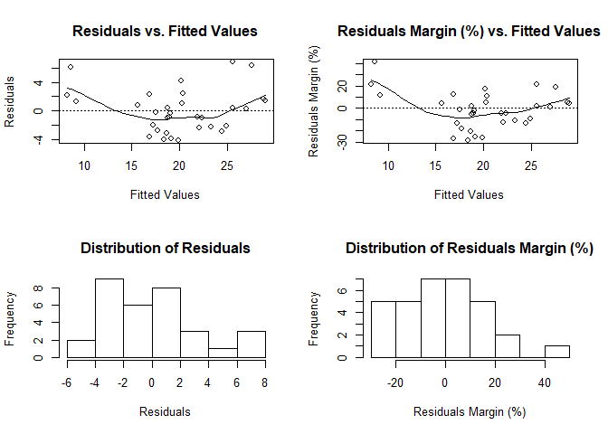
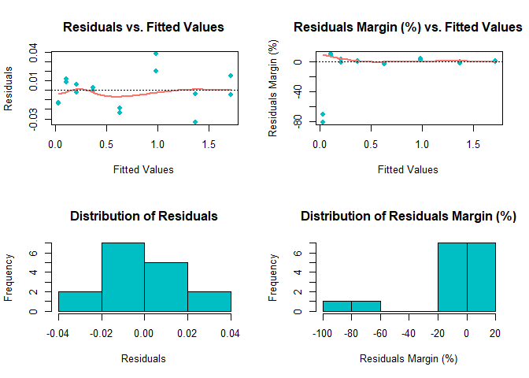
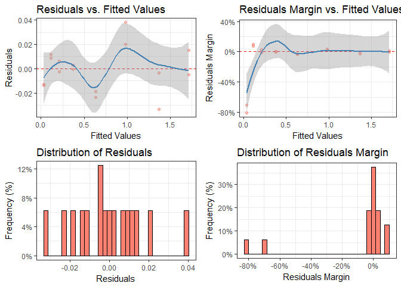
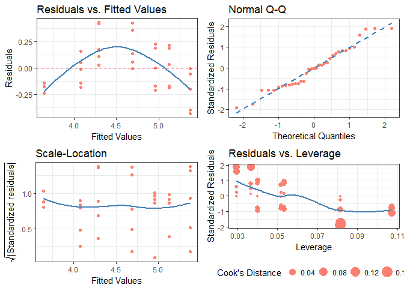

# diagnoser
***Robert Schnitman***  
***2017-11-14***  
***Recommended Citation:  
    &nbsp;&nbsp;&nbsp;&nbsp;&nbsp;&nbsp; Schnitman, Robert (2017). diagnoser v0.0.2.5. https://github.com/robertschnitman/diagnoser***

# Outline
0. Installation
1. Introduction
2. diagnose(), ggdiagnose(), and cdiagnose()
3. fitres() and fitresdf()
4. modeldf()
5. validate()
6. Conclusion

## 0. Installation
```r
## Ensure that you are running R 3.4.2 or higher.
## Package Dependencies:
#     lazyeval (>= 0.2.1), rlang (>= 0.1.4), scales (>= 0.5.0),
#  Package Imports:
#     ggplot2 (>= 2.2.1), gridExtra (>= 2.3)

# install.packages("devtools")
devtools::install_github("robertschnitman/diagnoser")
```

## 1. Introduction

The `diagnoser` package contains tools for regression diagnostics. Base R's plot(lm()) was the primary influence, as it was a useful tool for quickly assessing estimation bias and existence of heteroskedasticity; but interpreting more specialized concepts such as Cook's Distance proved to be difficult to understand for those without linear algebra knowledge. To improve upon comprehension for introductory students, I developed **diagnose()** and **ggdiagnose()**. Individuals with a fondness for the classics would appreciate **cdiagnose()**, which recreates the original plot(lm()) with ggplot2 graphics.

Other functions such as **fitres()**, **modeldf()**, and **validate()** were inspired by tidyverse's broom library. While broom eases the process of transforming mnodel objects into data frames, outputs from tidy() lacked estimates integral to the social and health sciences, such as the margin of error for OLS estimates. Additionally, glance() does not produce a pseudo r-squared for general linear models. The functions **modeldf()** and **validate()** seek to fulfill the gaps from these broom functions.

The following sections provide examples.

## 2. diagnose(), ggdiagnose(), and cdiagnose()

The functions **diagnose()** and **ggdiagnose()** provide alternatives for the plot(lm()) approach. The Q-Q, Scale-Location, and Residuals-vs.-Leverage plots in the latter method can present difficulties in interpretations. For example, Cook's Distance typically is not taught at the secondary and undergraduate levels--when it is, teachers will forego explanation of the math due to its complexity and instead focus solely on the interpretation, leaving students in the dark on how the statistic works. If the goal is to maximize students' comprehension of detecting heteroskedasticity, one option is to replace the three previously mentioned graphs with histograms and an addition of another variable: residuals margin, the residuals as a percentage of the values for the dependent variable (i.e. (residuals ÷ actual values)\*100).

Thinking of residuals in terms of percent differences can help determine their *magnitude*. For example, if you notice an outlier in the residuals having the value of "5", does this issue necessitate a re-estimation of the model that excludes this observation? A common method is to examine the (adjusted) R-squared before-and-after the outlier exclusion. The problem of "mining" the model occurs, however, and heightens the risk of a Type 1 Error (i.e. false positive). One solution, then, is to confirm whether this extremity is substantively different from the rest of the values--you may, based on prior knowledge, decide whether thresholds of 10% or 15% should be marked as such.

Overall, with these functions, students will learn how to visualize homoskedasticity/heteroskedasticity and the magnitude of outliers based on familiar concepts as opposed to being inundated with hastily-taught new ones that assume a sufficient understanding of linear algebra.

However, for those with advanced training or simply disagree with me, I also present a "classic" version of the original base R residual diagnostics plot: **cdiagnose()**, a recreation of plot(lm()) with ggplot2 graphics. The Residuals vs. Leverage graph is the most differentiated one from the original, using the size of the points to indicate the degree of Cook's Distance (as inspired by Raju Rimal's diagPlot(): <https://rpubs.com/therimalaya/43190>).

Because base R's plotting of model objects do not include NLM/NLS objects, neither does **cdiagnose()**, which is justified considering the linear algebra involved in leverage and Cook's Distance. Nonetheless, future work will consider an alternative for non-linear models.

### diagnose()
``` r
# OLS case
model.lm <- lm(data = mtcars, formula = mpg ~ wt + gear)

diagnose(model.lm, fit_type = 'response', residual_type = 'response')
  # The fit_type option specifies prediction type in predict(). 
  # Similarly, residual_type specifies for resid().
  # These inputs are beneficial for glm objects using the binomial family.
```



``` r
# NLS case
require(graphics)
DNase1    <- subset(DNase, Run == 1)
fm1DNase1 <- nls(density ~ SSlogis(log(conc), Asym, xmid, scal), DNase1, model = TRUE)
diagnose(fm1DNase1, point_color = '#00BFC4', line_color = '#F8766D', pch = 16, lwd = 2)
  # Graph editing inputs. Recommended for larger data, as ggplot2 in ggdiagnose() and cdiagnose() can be slow.
```


### ggdiagnose()
``` r
# NLS case
ggdiagnose(fm1DNase1, fit_type = 'response', residual_type = 'response',
           bins = NROW(mtcars), se = TRUE, freqpct = TRUE, alpha = 0.5)
  # The fit_type option specifies prediction type in predict(). 
  #   Similarly, residual_type specifies for resid().
  #   These inputs are beneficial for glm objects using the binomial family.
  # Default bins value is 30.
  # Default se value is TRUE.
  # Default freqpct value is FALSE.
  # Default alpha value is 1.
```



### cdiagnose()

``` r
model.lm <- lm(data = mtcars, formula = mpg ~ wt + gear)

cdiagnose(model.lm, fit_type = 'response', residual_type = 'response', se = FALSE, alpha = 1)
  # The fit_type option specifies prediction type in predict(). 
  #   Similarly, residual_type specifies for resid().
  #   These inputs are beneficial for glm objects using the binomial family.
  # Default bins value is 30.
  # Default se value is FALSE.
  # Default alpha value is 1.
```



## 3. fitres() & fitresdf()

The functions **fitres()** and **fitresdf()** will look similar to those who have used augment() from tidyverse's broom.

The former creates a matrix of the fitted values, residuals, and residuals as a proportion (percent) based on the actual dependent variable's values. The latter produces a data frame from *merging* the fitted values and residual variables as columns to a specified dataset. If there are any rows with missing values in the original data frame, then they will be moved to the bottom of the new one.

### fitres()

``` r
model.lm <- lm(data = mtcars, formula = mpg ~ wt + gear)

head(fitres(model.lm, type = 'response'))
    # default type value is 'response'.
```

    ##                        fit   residual residual_margin
    ## Mazda RX4         23.26669 -2.2666926     -0.10793774
    ## Mazda RX4 Wag     21.86801 -0.8680127     -0.04133394
    ## Datsun 710        24.91220 -2.1121984     -0.09264028
    ## Hornet 4 Drive    20.32266  1.0773414      0.05034305
    ## Hornet Sportabout 19.08853 -0.3885293     -0.02077697
    ## Valiant           18.97883 -0.8788289     -0.04855408

### fitresdf()

``` r
model.lm <- lm(data = mtcars, formula = mpg ~ wt + gear)

head(fitresdf(model = model.lm, data = mtcars, type = 'response'))
```

    ##                    mpg cyl disp  hp drat    wt  qsec vs am gear carb
    ## Mazda RX4         21.0   6  160 110 3.90 2.620 16.46  0  1    4    4
    ## Mazda RX4 Wag     21.0   6  160 110 3.90 2.875 17.02  0  1    4    4
    ## Datsun 710        22.8   4  108  93 3.85 2.320 18.61  1  1    4    1
    ## Hornet 4 Drive    21.4   6  258 110 3.08 3.215 19.44  1  0    3    1
    ## Hornet Sportabout 18.7   8  360 175 3.15 3.440 17.02  0  0    3    2
    ## Valiant           18.1   6  225 105 2.76 3.460 20.22  1  0    3    1
    ##                        fit   residual residual_margin
    ## Mazda RX4         23.26669 -2.2666926     -0.10793774
    ## Mazda RX4 Wag     21.86801 -0.8680127     -0.04133394
    ## Datsun 710        24.91220 -2.1121984     -0.09264028
    ## Hornet 4 Drive    20.32266  1.0773414      0.05034305
    ## Hornet Sportabout 19.08853 -0.3885293     -0.02077697
    ## Valiant           18.97883 -0.8788289     -0.04855408

``` r
# Warning message displays when the specified data frame has missing values.
df        <- mtcars
df[1:3, ] <- NA
model.lm  <- lm(data = df, formula = mpg ~ wt + gear)
tail(fitresdf(model.lm, df))
```

    ## Warning in fitresdf(model.lm, data = df, type = "response"): 3 rows with
    ## missing values were moved to the bottom of the data frame.

    ##                mpg cyl disp  hp drat   wt qsec vs am gear carb      fit
    ## Ferrari Dino  19.7   6  145 175 3.62 2.77 15.5  0  1    5    6 22.38605
    ## Maserati Bora 15.0   8  301 335 3.54 3.57 14.6  0  1    5    8 17.89170
    ## Volvo 142E    21.4   4  121 109 4.11 2.78 18.6  1  1    4    2 22.63986
    ## Mazda RX4       NA  NA   NA  NA   NA   NA   NA NA NA   NA   NA       NA
    ## Mazda RX4 Wag   NA  NA   NA  NA   NA   NA   NA NA NA   NA   NA       NA
    ## Datsun 710      NA  NA   NA  NA   NA   NA   NA NA NA   NA   NA       NA
    ##                residual residual_margin
    ## Ferrari Dino  -2.686050     -0.13634772
    ## Maserati Bora -2.891697     -0.19277978
    ## Volvo 142E    -1.239856     -0.05793718
    ## Mazda RX4            NA              NA
    ## Mazda RX4 Wag        NA              NA
    ## Datsun 710           NA              NA


## 4. modeldf()

The function **modeldf()** has similar features to tidying model objects with additions.

### Case 1: OLS

``` r
model.lm <- lm(data = mtcars, formula = mpg ~ wt + gear)

modeldf(model = model.lm, conf = 0.90) # conf = 0.95 is the default value; can be omitted.
```

    ##          term       beta        se      moe  ci_lower  ci_upper          t
    ## 1 (Intercept) 38.9156530 5.0973967 8.661124 30.254529 47.576777  7.6344173
    ## 2          wt -5.4850192 0.6986582 1.187109 -6.672128 -4.297910 -7.8507908
    ## 3        gear -0.3195525 0.9265431 1.574315 -1.893867  1.254762 -0.3448868
    ##              p
    ## 1 2.037781e-08
    ## 2 1.170427e-08
    ## 3 7.326683e-01

### Case 2: GLM (logit)

``` r
model.glm <- glm(data = mtcars, formula = am ~ mpg + disp, family = binomial(link = 'logit'))

modeldf(model = model.glm, conf = 0.90) # conf = 0.95 is the default value; can be omitted.
```

    ##          term         beta          se        moe     ci_lower    ci_upper
    ## 1 (Intercept) -2.256714436 4.760078598 7.80654013 -10.43852072 5.549825690
    ## 2         mpg  0.169978288 0.168372592 0.30799943  -0.08875314 0.477977714
    ## 3        disp -0.007614694 0.007811081 0.01182511  -0.02216001 0.004210416
    ##            z         p
    ## 1 -0.4740918 0.6354344
    ## 2  1.0095366 0.3127174
    ## 3 -0.9748579 0.3296308

### Case 3: NLS

``` r
require(graphics)
DNase1    <- subset(DNase, Run == 1)
fm1DNase1 <- nls(density ~ SSlogis(log(conc), Asym, xmid, scal), DNase1, model = TRUE)

modeldf(model = fm1DNase1, conf = 0.85) # conf = 0.95 is the default value; can be omitted.
```

    ##   term     beta         se        moe  ci_lower ci_upper        t
    ## 1 Asym 2.345182 0.07815410 0.13175992 2.2343149 2.476941 30.00715
    ## 2 xmid 1.483092 0.08135333 0.13441752 1.3656609 1.617509 18.23025
    ## 3 scal 1.041455 0.03227082 0.05132188 0.9933049 1.092777 32.27236
    ##              p
    ## 1 2.165539e-13
    ## 2 1.218541e-10
    ## 3 8.506932e-14

## 5. validate()

The broom library's glance() had a vague label for the F statistic (simply "statistic") and lacked any kind of pseudo R-squared for logistic regressions.

Furthermore, While the same function is friendly for data frames, it's wide form is cumbersome for quickly ascertaining model validity. Thus, **validate()** produces similar output as a column vector, adding McFadden's pseudo R-squared for logistic regressions. Those who wish to have the values in broom's format can always transpose the vector.

### Case 1: OLS

``` r
model.lm <- lm(data = mtcars, formula = mpg ~ wt + gear)
validate(model.lm)
```

    ##                   model.lm
    ## n                32.000000
    ## rsq               0.753842
    ## adj.rsq           0.736866
    ## Fstat            44.405361
    ## df.num            3.000000
    ## df.den           29.000000
    ## p.value           0.000000
    ## median.residual  -0.293202
    ## mean.residual     0.000000
    ## sd.residual       2.990226
    ## rmse              2.943133
    ## AIC             167.898446
    ## BIC             173.761389
    ## loglik          -79.949223

### Case 2: GLM (logit)

``` r
model.glm <- glm(am ~ mpg + wt, mtcars, family = binomial(link = 'logit'))
validate(model.glm)
```

    ##                   model.glm
    ## n                 32.000000
    ## pseudo.rsq.mcfad   0.602490
    ## null.deviance     43.229733
    ## residual.deviance 17.184255
    ## df.null           31.000000
    ## df.residual       29.000000
    ## median.residual   -0.046842
    ## mean.residual     -0.044152
    ## sd.residual        0.743181
    ## rmse               0.732808
    ## AIC               23.184255
    ## BIC               27.581463
    ## loglik            -8.592128

## 6. Conclusion

I hope to improve upon these existing functions and create new ones that (1) minimize the programming tedium in statistical reporting and (2) assist people in diagnosing the validity of their results.

### In the future...

1. ~~Functions similar to broom's glance() (perhaps with other model diagnostics and making "statistic" be clear that it is referring to the F-statistic).~~ Completed 2017-12-01.  
2. ~~ggplot2 version of diagnose().~~ Completed 2017-11-15.
3. Add VIF modeldf().
4. Modify validate() for non-regression model cases.
5. ~~cdiagnose(): A ggplot2 version of the "classic" plot(lm()). Preferable for those with an understanding of Scale Location and Cook's Distance.~~ Completed 2017-11-15.
6. **mdiagnose()**: probability diagnostics with the margins library.
7. **marginsdf()**: margins results in a tidy data frame (with margin of errors and confidence intervals as in model()).
8.  ~~Simplify/combine lmdf() and glmdf(), as well as accept NLS objects.~~ Completed 2017-12-15 \[modeldf()\].
9.  Generate fit statistics in validation() for NLS models
10. **nlsdiagnose()**: Consider alternative set of graphs appropriate for NLS objects.

*End of Document*
