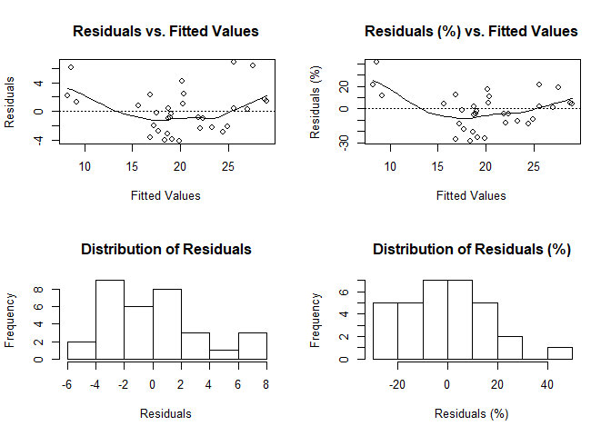
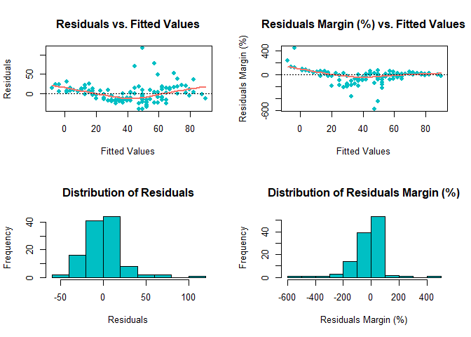
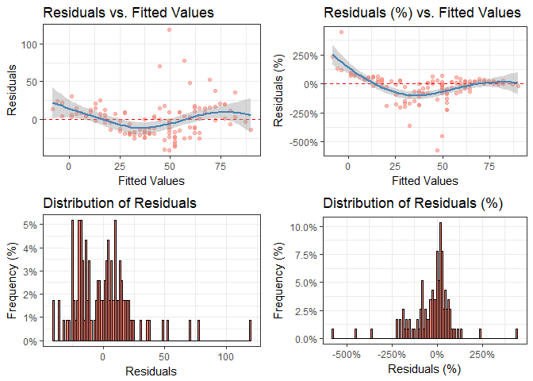
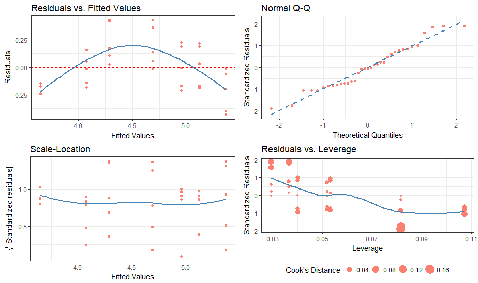

# diagnoser
***Robert Schnitman***  
***2017-11-14***  
***Recommended Citation:  
    &nbsp;&nbsp;&nbsp;&nbsp;&nbsp;&nbsp; Schnitman, Robert (2017). diagnoser v0.0.2.5. https://github.com/robertschnitman/diagnoser***

# Outline
0. Installation
1. Introduction
2. diagnose(), ggdiagnose(), and cdiagnose()
3. fitres()
4. modeldf()
5. validate()
6. Conclusion
7. References

## 0. Installation
```r
## Ensure that you are running R 3.4.2 or higher.
## Package Dependencies:
#     lazyeval (>= 0.2.1)
#  Package Imports:
#     ggplot2 (>= 2.2.1), gridExtra (>= 2.3), scales (>= 0.5.0), car (>= 2.1)

# install.packages("devtools")
devtools::install_github("robertschnitman/diagnoser")
```

## 1. Introduction

The `diagnoser` package contains tools for regression diagnostics. Base R's `plot(model.object)` was the primary influence, as it was a useful tool for quickly assessing estimation bias and existence of heteroskedasticity; but interpreting more specialized concepts such as Cook's Distance proved to be difficult to understand for those without linear algebra knowledge. To improve upon comprehension for introductory students, I developed **diagnose()** and **ggdiagnose()**. Individuals with a fondness for the classics would appreciate **cdiagnose()**, which recreates the original `plot(model.object)` with `ggplot2` graphics.

Other functions such as **fitres()**, **modeldf()**, and **validate()** were inspired by tidyverse's `broom` library. While `broom` eases the process of transforming model objects into data frames, outputs from `tidy()` lacked estimates integral to the social and health sciences, such as the margin of error for OLS estimates. Additionally, `glance()` does not produce a pseudo r-squared for general linear models. The functions **modeldf()** and **validate()** seek to close the gaps from these broom functions.

The following sections provide examples.

## 2. diagnose(), ggdiagnose(), and cdiagnose()

The functions **diagnose()** and **ggdiagnose()** provide alternatives for the `plot(model.object)` approach. The Q-Q, Scale-Location, and Residuals-vs.-Leverage plots in the latter method can present difficulties in interpretations. For example, Cook's Distance typically is not taught at the secondary and undergraduate levels--when it is, teachers will forego explanation of the math due to its complexity and instead focus solely on the interpretation, leaving students in the dark on how the statistic works. If the goal is to maximize students' comprehension of detecting heteroskedasticity, one option is to replace the three previously mentioned graphs with histograms and an addition of another variable: residuals as a percentage of the values for the dependent variable (i.e. `(residuals ÷ actual values)*100`).

Thinking of residuals in terms of percent differences can help determine their *magnitude*. For example, if you notice an outlier in the residuals having the value of "5", does this issue necessitate a re-estimation of the model that excludes this observation? A common method is to examine the (adjusted) R-squared before-and-after the outlier exclusion. The problem of "mining" the model occurs, however, and heightens the risk of a Type 1 Error (i.e. false positive). One solution, then, is to confirm whether this extremity is substantively different from the rest of the values--you may, based on prior knowledge, decide whether thresholds of 10% or 15% should be marked as such.

Overall, with these functions, students will learn how to visualize homoskedasticity/heteroskedasticity and the magnitude of outliers based on familiar concepts as opposed to being inundated with hastily-taught new ones that assume a sufficient understanding of linear algebra.

However, for those with advanced training or simply disagree with me, I also present a "classic" version of the original base R residual diagnostics plot: **cdiagnose()**, a recreation of `plot(model.object)` with ggplot2 graphics. The Residuals vs. Leverage graph is the most differentiated one from the original, using the size of the points to indicate the degree of Cook's Distance (as inspired by Raju Rimal's `diagPlot()`: <https://rpubs.com/therimalaya/43190>).

Because base R's plotting of model objects do not include NLM/NLS objects, neither does **cdiagnose()**, which is justified considering the linear algebra involved in leverage and Cook's Distance. Nonetheless, future work will consider an alternative for non-linear models.

### diagnose()

#### Case 1: OLS

``` r
# OLS case
model.lm <- lm(data = mtcars, formula = mpg ~ wt + gear)
diagnose(model.lm, fit_type = 'response', residual_type = 'response')
  # The fit_type option specifies prediction type in predict(). 
  #   Similarly, residual_type specifies for resid().
  #   These inputs are useful for glm objects using the binomial family.
```



#### Case 2: NLS

``` r
model.nls <- nls(Ozone ~ theta0 + Temp^theta1, airquality)
diagnose(model.nls, point_color = '#00BFC4', line_color = '#F8766D', pch = 16, lwd = 2)
  # Graph editing inputs. Recommended for larger data, as ggplot2 in ggdiagnose() and cdiagnose() can be slow.
```



### ggdiagnose()

``` r
# NLS case
model.nls <- nls(Ozone ~ theta0 + Temp^theta1, airquality)
ggdiagnose(model.nls, fit_type = 'response', residual_type = 'response',
           bins = nobs(model.nls), se = TRUE, freqpct = TRUE, alpha = 0.5)
  # The fit_type option specifies prediction type in predict(). 
  #   Similarly, residual_type specifies for resid().
  #   These inputs are useful for glm objects using the binomial family.
  # Default bins value is 30.
  # Default se value is TRUE.
  # Default freqpct value is FALSE.
  # Default alpha value is 1.           
```



### cdiagnose()

``` r
# OLS case
model.lm <- lm(data = Orange, formula = log(circumference) ~ age)

cdiagnose(model.lm, fit_type = 'response', residual_type = 'response', se = FALSE, alpha = 1)
  # The fit_type option specifies prediction type in predict(). 
  #   Similarly, residual_type specifies for resid().
  #   These inputs are useful for glm objects using the binomial family.
  # Default bins value is 30.
  # Default se value is FALSE.
  # Default alpha value is 1.
```



## 3. fitres()

The function **fitres()** will look similar to those who have used `augment()` from `broom`.

It creates a matrix of the fitted values, residuals, and residuals as a proportion (percent) based on the actual dependent variable's values. When the *data* input is specified, the function produces a dataframe that *merges* the fitted values and residual variables as columns to said specified dataset.

``` r
model.lm <- lm(data = mtcars, formula = mpg ~ wt + gear)
head(fitres(model.lm, fit_type = 'response'))
    # default type value is 'response'.
```

    ##                        fit   residual    residual_pct
    ## Mazda RX4         23.26669 -2.2666926     -0.10793774
    ## Mazda RX4 Wag     21.86801 -0.8680127     -0.04133394
    ## Datsun 710        24.91220 -2.1121984     -0.09264028
    ## Hornet 4 Drive    20.32266  1.0773414      0.05034305
    ## Hornet Sportabout 19.08853 -0.3885293     -0.02077697
    ## Valiant           18.97883 -0.8788289     -0.04855408

``` r
model.lm <- lm(data = mtcars, formula = mpg ~ wt + gear)
head(fitres(model = model.lm, data = mtcars, fit_type = 'response'))
```

    ##                    mpg cyl disp  hp drat    wt  qsec vs am gear carb       fit   residual    residual_pct
    ## Mazda RX4         21.0   6  160 110 3.90 2.620 16.46  0  1    4    4  23.26669 -2.2666926     -0.10793774
    ## Mazda RX4 Wag     21.0   6  160 110 3.90 2.875 17.02  0  1    4    4  21.86801 -0.8680127     -0.04133394
    ## Datsun 710        22.8   4  108  93 3.85 2.320 18.61  1  1    4    1  24.91220 -2.1121984     -0.09264028
    ## Hornet 4 Drive    21.4   6  258 110 3.08 3.215 19.44  1  0    3    1  20.32266  1.0773414      0.05034305
    ## Hornet Sportabout 18.7   8  360 175 3.15 3.440 17.02  0  0    3    2  19.08853 -0.3885293     -0.02077697
    ## Valiant           18.1   6  225 105 2.76 3.460 20.22  1  0    3    1  18.97883 -0.8788289     -0.04855408      

## 4. modeldf()

The function **modeldf()** has similar features to tidying model objects with additions. The margin of error (*moe*) and confidence interval columns (*ci\_\**) would inform those in the health sciences the impact range of their variables of interest--other discplines may benefit as well from these estimates. The variance inflation factors (*VIF*)--which are estimated with `vif()` from `car`--measure the extent of collinearity in linear models.

### Case 1: OLS

``` r
model.lm <- lm(data = mtcars, formula = mpg ~ disp + hp + wt + gear + am)
modeldf(model = model.lm, conf = 0.90) # conf = 0.95 is the default value; can be omitted.
```

    ##          term         coef         se        moe    ci_lower    ci_upper          t            p      vif
    ## 1 (Intercept) 32.108024910 4.84359733 8.26132640 23.84669851 40.36935131  6.6289625 4.959127e-07       NA
    ## 2          am  1.605381694 1.78234460 3.03999888 -1.43461719  4.64538058  0.9007134 3.760085e-01 3.583076
    ## 3        disp  0.005352328 0.01178752 0.02010500 -0.01475267  0.02545733  0.4540675 6.535481e-01 9.668205
    ## 4        gear  0.651585626 1.21191542 2.06706466 -1.41547904  2.71865029  0.5376494 5.953915e-01 3.621713
    ## 5          hp -0.042892355 0.01424230 0.02429192 -0.06718428 -0.01860043 -3.0116168 5.721679e-03 4.319422
    ## 6          wt -3.113042246 1.17912588 2.01113824 -5.12418048 -1.10190401 -2.6401271 1.382770e-02 6.029643

### Case 2: GLM (logit)

``` r
model.glm <- glm(data = mtcars, formula = am ~ mpg + disp + hp, family = binomial(link = 'logit'))
modeldf(model = model.glm, conf = 0.90) # conf = 0.95 is the default value; can be omitted.
```

    ##          term        coef          se         moe     ci_lower    ci_upper         z          p       vif
    ## 1 (Intercept) -33.8128314 24.17533401 26.83504619 -94.19070326 -6.97778523 -1.398650 0.16191796        NA
    ## 2        disp  -0.0654460  0.04304626  0.04707836  -0.16992781 -0.01836764 -1.520364 0.12841942 15.021316
    ## 3          hp   0.1493636  0.07871156  0.20423473   0.05857355  0.35359832  1.897607 0.05774791 23.014959
    ## 4         mpg   1.2849763  0.89894752  2.22397961   0.29320289  3.50895588  1.429423 0.15288269  8.822745

### Case 3: NLS

``` r
model.nls <- nls(Ozone ~ theta0 + Temp^theta1, airquality)
modeldf(model = model.nls, conf = 0.85) # conf = 0.95 is the default value; can be omitted.
```

    ##   parameter        coef         se         moe    ci_lower    ci_upper           t            p
    ## 1    theta0 -121.608226 13.2364581 19.40604989 -140.672736 -102.202176   -9.187369 2.167395e-15
    ## 2    theta1    1.170315  0.0182639  0.02489023    1.141823    1.195206   64.078073 3.014033e-91

## 5. validate()

The `glance()` function from `broom` had a vague label for the F statistic (simply "statistic") and lacked any kind of pseudo R-squared for logistic regressions.

Furthermore, while the same function is friendly for data frames, its wide form is cumbersome for quickly ascertaining model validity. Thus, **validate()** produces similar output as a column vector, adding McFadden's pseudo R-squared and the apparent error rate--defined as the ratio of the number of incorrect predictions to correct ones (i.e. number incorrect / number correct)--for logistic regressions. Those who wish to have the values in the format of `broom` can always transpose the vector. Alternatively, converting the output to a dataframe is simple by setting *dataframe = TRUE* in the function.

Output definitions are in the help file associated with this function.

### Case 1: OLS

``` r
model.lm <- lm(data = mtcars, formula = mpg ~ wt + gear)
validate(model.lm)
```

    ##                   model.lm
    ## n                32.000000
    ## rsq               0.753842
    ## adj.rsq           0.736866
    ## F.stat           44.405361
    ## df.num            3.000000
    ## df.den           29.000000
    ## p.value           0.000000
    ## residual.median  -0.293202
    ## residual.mean     0.000000
    ## residual.sd       2.990226
    ## residual.se       0.528602
    ## rmse              2.943133
    ## mad               1.943778
    ## mae               2.353567
    ## medianpe         -0.016107
    ## mpe              -0.015267
    ## sdpe              0.161915
    ## sepe              0.028623
    ## AIC             167.898446
    ## BIC             173.761389
    ## loglik          -79.949223

``` r
validate(model.lm, TRUE) # dataframe
```

    ##          statistic   model.lm
    ## 1                n  32.000000
    ## 2              rsq   0.753842
    ## 3          adj.rsq   0.736866
    ## 4           F.stat  44.405361
    ## 5           df.num   3.000000
    ## 6           df.den  29.000000
    ## 7          p.value   0.000000
    ## 8  residual.median  -0.293202
    ## 9    residual.mean   0.000000
    ## 10     residual.sd   2.990226
    ## 11     residual.se   0.528602
    ## 12            rmse   2.943133
    ## 13             mad   1.943778
    ## 14             mae   2.353567
    ## 15        medianpe  -0.016107
    ## 16             mpe  -0.015267
    ## 17            sdpe   0.161915
    ## 18            sepe   0.028623
    ## 19             AIC 167.898446
    ## 20             BIC 173.761389
    ## 21          loglik -79.949223


### Case 2: GLM (logit)

``` r
model.glm <- glm(am ~ mpg + wt, mtcars, family = binomial(link = 'logit'))
validate(model.glm) # Note the inapplicability of the percent error (pe) statistics.
```

    ##                   model.glm
    ## n                 32.000000
    ## pseudo.rsq.mcfad   0.602490
    ## aer                0.062500
    ## null.deviance     43.229733
    ## residual.deviance 17.184255
    ## df.null           31.000000
    ## df.residual       29.000000
    ## residual.median   -0.046842
    ## residual.mean     -0.044152
    ## residual.sd        0.743181
    ## residual.se        0.131377
    ## rmse               0.732808
    ## mad                0.384793
    ## mae                0.508942
    ## medianpe               -Inf
    ## mpe                    -Inf
    ## sdpe                    NaN
    ## sepe                    NaN
    ## AIC               23.184255
    ## BIC               27.581463
    ## loglik            -8.592128

### Case 3: NLS

``` r
model.nls <- nls(Ozone ~ theta0 + Temp^theta1, airquality)
validate(model.nls)
```

    ##                         model.nls
    ## n                      116.000000
    ## iterations               4.000000
    ## convergence_tolerance    0.000001
    ## sigma                   23.624178
    ## df.sigma               114.000000
    ## residual.median         -0.684547
    ## residual.mean           -0.000002
    ## residual.sd             23.521240
    ## residual.se              2.183892
    ## rmse                    23.419636
    ## mad                     15.047691
    ## mae                     17.120045
    ## medianpe                -0.011579
    ## mpe                     -0.287614
    ## sdpe                     1.161944
    ## sepe                     0.107884
    ## AIC                   1066.823097
    ## BIC                   1075.083868
    ## loglik                -530.411549

## 6. Conclusion

The functions discussed and demonstrated will be improved on a continuing basis to (1) minimize the programming tedium in statistical reporting and (2) assist people in diagnosing the validity of their results. New functions to be added based on feasibility and future needs as necessary.

## 7. References
`broom` library. https://github.com/tidyverse/broom  
Raju Rimal's diagPlot. https://rpubs.com/therimalaya/43190

*End of Document*
