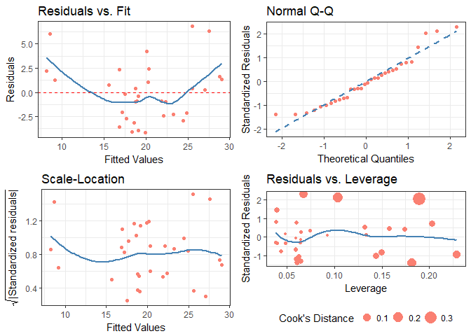

# diagnoser
***Robert Schnitman***  
***2017-11-14***  
***Recommended Citation:  
    &nbsp;&nbsp;&nbsp;&nbsp;&nbsp;&nbsp; Schnitman, Robert (2017). diagnoser v0.0.2.2. https://github.com/robertschnitman/diagnoser***

## 0. Installation
```r
## Ensure that you are running R >= 3.4.2.
## Package Dependencies:
#     tm (>= 0.7.0), ggplot2 (>= 2.2.1), gridExtra (>= 2.3), 
#     lazyeval (>= 0.2.1), rlang (>= 0.1.4), scales (>= 0.5.0)

# install.packages("devtools")
devtools::install_github("robertschnitman/diagnoser")
```

## 1. Introduction

This R package contains tools for diagnostics, modeling, and data management. Base R's plot(lm()) was the primary influence, as it was a useful tool for quickly assessing estimation bias and existence of heteroskedasticity; but interpreting more specialized concepts such as Cook's Distance can prove to be difficult to understand for those without linear algebra knowledge. To improve upon comprehension for introductory students, I developed **diagnose() and ggdiagnose()**. Individuals with a fondness for the classics would appreciate **cdiagnose()**, which recreates the original plot(lm()) with ggplot2 graphics. 

Other functions such as **lmdf()** and **fitresdf()** were inspired by tidyverse's broom library. Broom is fantastic for transforming model objects into data frames; but I was not quite satisfied with the mentioned its tidy() outputs (such as the lack of confidence intervals for OLS estimates). 

The following sections provide examples.

## 2. diagnose(), ggdiagnose(), and cdiagnose()

The functions **diagnose()** and **ggdiagnose()** provide alternatives for the plot(lm()) approach. The Q-Q, Scale-Location, and Residuals-vs.-Leverage plots in the latter method can present difficulties in interpretations. For example, Cook's Distance typically is not taught at the secondary and undergraduate levels--when it is, teachers will forego explanation of the math due to its complexity and instead focus solely on the interpretation, leaving students in the dark on how the statistic works. If the goal is to maximize students' comprehension of detecting heteroskedasticity, one option is to replace the three previously mentioned graphs with histograms and an addition of another variable: residuals as a percentage of the fitted values (i.e. (residuals ÷ fitted values)\*100).

Thinking of residuals in terms of percent differences can help determine their *magnitude*. For example, if you notice an outlier in the residuals having the value of "5", does this issue necessitate a re-estimation of the model that excludes this observation? A common method is to examine the (adjusted) R-squared before-and-after the outlier exclusion. The problem of "mining" the model occurs, however, and heightens the risk of a Type 1 Error (i.e. false positive). One solution, then, is to confirm whether this extremity is substantively different from the rest of the values--you may, based on prior knowledge, decide whether thresholds of 10% or 15% should be marked as such.

Overall, with these functions, students will learn how to visualize homoskedasticity/heteroskedasticity and the magnitude of outliers based on familiar concepts as opposed to being inundated with hastily-taught new ones that assume a sufficient understanding of linear algebra.

However, for those with advanced training or simply disagree with me, I also present a "classic" version of the original base R residual diagnostics plot: **cdiagnose()**, a recreation of plot(lm()) with ggplot2 graphics. The Residuals vs. Leverage graph is the most differentiated one from the original, using the size of the points to indicate the degree of Cook's Distance (as inspired by Raju Rimal's diagPlot(): <https://rpubs.com/therimalaya/43190>).

### diagnose()
``` r
model.lm <- lm(data = mtcars, formula = mpg ~ wt + gear)

diagnose(model.lm)
```


### ggdiagnose()
``` r
model.lm <- lm(data = mtcars, formula = mpg ~ wt + gear)

ggdiagnose(model.lm, bins = NROW(mtcars), se = TRUE, freqpct = TRUE, alpha = 0.5)
    # default bins value is 30.
    # default se value is TRUE.
    # default freqpct value is FALSE.
    # default alpha value is 1.
```


### cdiagnose()

``` r
model.lm <- lm(data = mtcars, formula = mpg ~ wt + gear)

cdiagnose(model.lm, se = FALSE, alpha = 1)
    # default se value is FALSE.
    # default alpha value is 1.
```



## 3. fitres() & fitresdf()

The functions **fitres()** and **fitresdf()** will look similar to those who have used augment() from tidyverse's broom.

The former creates a matrix of the fitted values, residuals, and residuals as a proportion (percent) based on an OLS model or GLM. The latter *merges* these items as columns to a specified dataset. If there are any rows with missing values in the original data frame, then they will be moved to the bottom of the new one.

### fitres()

``` r
model.lm <- lm(data = mtcars, formula = mpg ~ wt + gear)

head(fitres(model.lm))
```

    ##                        fit   residual residual_pct
    ## Mazda RX4         23.26669 -2.2666926  -0.09742221
    ## Mazda RX4 Wag     21.86801 -0.8680127  -0.03969326
    ## Datsun 710        24.91220 -2.1121984  -0.08478571
    ## Hornet 4 Drive    20.32266  1.0773414   0.05301183
    ## Hornet Sportabout 19.08853 -0.3885293  -0.02035407
    ## Valiant           18.97883 -0.8788289  -0.04630575

### fitresdf()

``` r
model.lm <- lm(data = mtcars, formula = mpg ~ wt + gear)

head(fitresdf(data = mtcars, model = model.lm))
```

    ##                    mpg cyl disp  hp drat    wt  qsec vs am gear carb
    ## Mazda RX4         21.0   6  160 110 3.90 2.620 16.46  0  1    4    4
    ## Mazda RX4 Wag     21.0   6  160 110 3.90 2.875 17.02  0  1    4    4
    ## Datsun 710        22.8   4  108  93 3.85 2.320 18.61  1  1    4    1
    ## Hornet 4 Drive    21.4   6  258 110 3.08 3.215 19.44  1  0    3    1
    ## Hornet Sportabout 18.7   8  360 175 3.15 3.440 17.02  0  0    3    2
    ## Valiant           18.1   6  225 105 2.76 3.460 20.22  1  0    3    1
    ##                        fit   residual residual_pct
    ## Mazda RX4         23.26669 -2.2666926  -0.09742221
    ## Mazda RX4 Wag     21.86801 -0.8680127  -0.03969326
    ## Datsun 710        24.91220 -2.1121984  -0.08478571
    ## Hornet 4 Drive    20.32266  1.0773414   0.05301183
    ## Hornet Sportabout 19.08853 -0.3885293  -0.02035407
    ## Valiant           18.97883 -0.8788289  -0.04630575

``` r
# Warning message displays when the specified data frame has missing values.
df        <- mtcars
df[1:3, ] <- NA
model.lm  <- lm(data = df, formula = mpg ~ wt + gear)
tail(fitresdf(df, model.lm))
```

    ## Warning in fitresdf(df, model.lm): 3 rows with missing values were moved to
    ## the bottom of the data frame.

    ##                mpg cyl disp  hp drat   wt qsec vs am gear carb      fit
    ## Ferrari Dino  19.7   6  145 175 3.62 2.77 15.5  0  1    5    6 22.38605
    ## Maserati Bora 15.0   8  301 335 3.54 3.57 14.6  0  1    5    8 17.89170
    ## Volvo 142E    21.4   4  121 109 4.11 2.78 18.6  1  1    4    2 22.63986
    ## Mazda RX4       NA  NA   NA  NA   NA   NA   NA NA NA   NA   NA       NA
    ## Mazda RX4 Wag   NA  NA   NA  NA   NA   NA   NA NA NA   NA   NA       NA
    ## Datsun 710      NA  NA   NA  NA   NA   NA   NA NA NA   NA   NA       NA
    ##                residual residual_pct
    ## Ferrari Dino  -2.686050  -0.11998768
    ## Maserati Bora -2.891697  -0.16162227
    ## Volvo 142E    -1.239856  -0.05476429
    ## Mazda RX4            NA           NA
    ## Mazda RX4 Wag        NA           NA
    ## Datsun 710           NA           NA


## 4. lmdf() & glmdf()

The functions **lmdf()** and **glmdf()** have similar features to tidying model objects with broom--better variables in the output, but these two functions can only handle lm() and glm() objects.

The former presents OLS estimates with a margin of error and confidence intervals. The confidence level can be specified (90, 95, or 99) or left to the default value of 95 (representing 95% confidence). The latter function applies for GLM objects.

### lmdf()

``` r
model.lm <- lm(data = mtcars, formula = mpg ~ wt + gear)

lmdf(model = model.lm, conf = 90)
```

    ##          term       beta        se      moe  ci_lower  ci_upper          t
    ## 1 (Intercept) 38.9156530 5.0973967 8.385217 30.530436 47.300871  7.6344173
    ## 2          wt -5.4850192 0.6986582 1.149293 -6.634312 -4.335727 -7.8507908
    ## 3        gear -0.3195525 0.9265431 1.524163 -1.843716  1.204611 -0.3448868
    ##              p
    ## 1 2.037781e-08
    ## 2 1.170427e-08
    ## 3 7.326683e-01

``` r
lmdf(model = model.lm, conf = 95) # conf = 95 is the default value; can be omitted.
```

    ##          term       beta        se      moe  ci_lower  ci_upper          t
    ## 1 (Intercept) 38.9156530 5.0973967 9.990897 28.924756 48.906550  7.6344173
    ## 2          wt -5.4850192 0.6986582 1.369370 -6.854389 -4.115649 -7.8507908
    ## 3        gear -0.3195525 0.9265431 1.816025 -2.135577  1.496472 -0.3448868
    ##              p
    ## 1 2.037781e-08
    ## 2 1.170427e-08
    ## 3 7.326683e-01

``` r
lmdf(model = model.lm, conf = 99)
```

    ##          term       beta        se       moe  ci_lower  ci_upper
    ## 1 (Intercept) 38.9156530 5.0973967 13.130894 25.784759 52.046547
    ## 2          wt -5.4850192 0.6986582  1.799743 -7.284763 -3.685276
    ## 3        gear -0.3195525 0.9265431  2.386775 -2.706328  2.067223
    ##            t            p
    ## 1  7.6344173 2.037781e-08
    ## 2 -7.8507908 1.170427e-08
    ## 3 -0.3448868 7.326683e-01

### glmdf()

``` r
model.glm <- glm(data = mtcars, formula = am ~ mpg + gear, family = binomial(link = 'logit'))

glmdf(model = model.glm, conf = 90)
```

    ##          term        beta           se          moe      ci_lower
    ## 1 (Intercept) -88.2992383 1.387881e+04 2.283064e+04 -2.291894e+04
    ## 2         mpg   0.3366025 2.456691e-01 4.041256e-01 -6.752315e-02
    ## 3        gear  20.3061829 3.469702e+03 5.707659e+03 -5.687353e+03
    ##       ci_upper            z         p
    ## 1 2.274234e+04 -0.006362162 0.9949238
    ## 2 7.407281e-01  1.370145880 0.1706414
    ## 3 5.727966e+03  0.005852429 0.9953305

``` r
glmdf(model = model.glm, conf = 95) # conf = 95 is the default value; can be omitted.
```

    ##          term        beta           se          moe      ci_lower
    ## 1 (Intercept) -88.2992383 1.387881e+04 2.720247e+04 -2.729077e+04
    ## 2         mpg   0.3366025 2.456691e-01 4.815114e-01 -1.449089e-01
    ## 3        gear  20.3061829 3.469702e+03 6.800615e+03 -6.780309e+03
    ##       ci_upper            z         p
    ## 1 2.711417e+04 -0.006362162 0.9949238
    ## 2 8.181138e-01  1.370145880 0.1706414
    ## 3 6.820922e+03  0.005852429 0.9953305

``` r
glmdf(model = model.glm, conf = 99)
```

    ##          term        beta           se          moe      ci_lower
    ## 1 (Intercept) -88.2992383 1.387881e+04 3.575181e+04 -3.584011e+04
    ## 2         mpg   0.3366025 2.456691e-01 6.328435e-01 -2.962411e-01
    ## 3        gear  20.3061829 3.469702e+03 8.937952e+03 -8.917646e+03
    ##       ci_upper            z         p
    ## 1 35663.514542 -0.006362162 0.9949238
    ## 2     0.969446  1.370145880 0.1706414
    ## 3  8958.257954  0.005852429 0.9953305

## 5. cleancorpus() and wfreqdf()

When I first learned about using the tm library, the process for converting raw text into a data frame of word frequencies was tedious: several tm\_map()'s had to be applied to the corpus and transformations for the TDM-to-dataframe ordeal. As a result, I created two functions specifically for the overall procedure from raw text to data frame. It is especially useful for bar charts.

While **wfreqdf()** nests **cleancorpus()**, the latter can be used independently to perform basic corpus corrections: it removes punctuation, strips white space, deletes numbers, and erases stopwords.

At this time, these functions "work" for English stop words only. Other languages can be used for the stopwords argument, but perhaps they won't work as well as for English (for now!).

``` r
# library(tm) assumed.
# wfreqdf() depends on cleancorpus().
# setting stopwords is based on the tm library. E.g. English --> stopwords = 'english'
# nonsense.txt is found in the main diagnoser directory.

head(wfreqdf(filename = 'nonsense.txt', stopwords = 'english'))
```

    ##          word freq
    ## 1     journal    3
    ## 2      former    2
    ## 3        just    2
    ## 4 statistical    2
    ## 5         you    2
    ## 6  achievable    1

## 6. Conclusion and Future Work

I hope to improve upon these existing functions and create new ones that (1) minimize the programming tedium in statistical reporting and (2) assist people in diagnosing the validity of their results.

### In the future...

1. Functions similar to broom's glance() (perhaps with other model diagnostics and making "statistic" be clear that it is referring to the F-statistic).  
2. ~~ggplot2 version of diagnose().~~ Completed 2017-11-15.
3. Add VIF in **lmdf()** & **glmdf()**. Feasible solution with tidyr, but I would rather stay close to base R as much as possible.
4. For wfreqdf, test for Japanese stop words (my kanji is extremely weak).
5. ~~cdiagnose(): A ggplot2 version of the "classic" plot(lm()). Preferable for those with an understanding of Scale Location and Cook's Distance.~~ Completed 2017-11-15.
6. **mdiagnose()**: probability diagnostics with the margins library.
7. **marginsdf()**: margins results in a tidy data frame (with margin of errors and confidence intervals as in lmdf() and glmdf()).

*End of Document*
