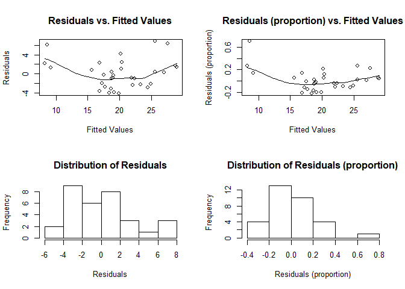

# schnitr
***Robert Schnitman***  
***2017-11-14***  
***Recommended Citation:  
    &nbsp;&nbsp;&nbsp;&nbsp;&nbsp;&nbsp; Schnitman, Robert (2017). GitHub Repository: schnitr. https://github.com/robertschnitman/schnitr***

## 1. Introduction

This repository hosts my family of R functions for statistical modeling, diagnostics, and data management. Many of them are inspired by tidyverse's broom library; but I was not quite satisfied with the mentioned library's outputs (such as the lack of confidence intervals for OLS estimates). Others are simply "shortcuts" for standard procedures, such as residual analysis and word frequencies. More functions will be added as they come.

The following sections provide examples.

## 2. diagnose()

The function diagnose() provides an alternative to the plot(model.lm) approach. The Q-Q, Scale-Location, and Residuals-vs.-Leverage plots in the latter option can present difficulties in interpretations. For example, Cook's Distance ("Leverage") typically is not taught at the secondary and undergraduate level--when it is, teachers will forego explanation of the math and focus on the interpretation, leaving students in the dark. If the goal is to maximize student's understanding of diagnosing their results, one option is to replace the three previously mentioned graphs with histograms and an addition of another variable: residuals as a proportion of the fitted values (i.e. residuals ÷ fitted values).

``` r
model.lm <- lm(data = mtcars, formula = mpg ~ wt + gear)

diagnose(model.lm)
```



## 3. fitres() & fitresdf()

The functions fitres() and fitresdf() will look similar to those who have used augment() from tidyverse's broom.

The former creates a matrix of the fitted values, residuals, and residuals as a proportion (percent) based on an OLS model or GLM. The latter *appends* these items as columns to a specified dataset (usually, the original dataset; but it can also be used for training & test datasets of the same size).

### fitres()

``` r
model.lm <- lm(data = mtcars, formula = mpg ~ wt + gear)

head(fitres(model.lm))
```

    ##                        fit   residual residual_pct
    ## Mazda RX4         23.26669 -2.2666926  -0.09742221
    ## Mazda RX4 Wag     21.86801 -0.8680127  -0.03969326
    ## Datsun 710        24.91220 -2.1121984  -0.08478571
    ## Hornet 4 Drive    20.32266  1.0773414   0.05301183
    ## Hornet Sportabout 19.08853 -0.3885293  -0.02035407
    ## Valiant           18.97883 -0.8788289  -0.04630575

### fitresdf()

``` r
model.lm <- lm(data = mtcars, formula = mpg ~ wt + gear)

head(fitresdf(data = mtcars, model = model.lm))
```

    ##                    mpg cyl disp  hp drat    wt  qsec vs am gear carb
    ## Mazda RX4         21.0   6  160 110 3.90 2.620 16.46  0  1    4    4
    ## Mazda RX4 Wag     21.0   6  160 110 3.90 2.875 17.02  0  1    4    4
    ## Datsun 710        22.8   4  108  93 3.85 2.320 18.61  1  1    4    1
    ## Hornet 4 Drive    21.4   6  258 110 3.08 3.215 19.44  1  0    3    1
    ## Hornet Sportabout 18.7   8  360 175 3.15 3.440 17.02  0  0    3    2
    ## Valiant           18.1   6  225 105 2.76 3.460 20.22  1  0    3    1
    ##                        fit   residual residual_pct
    ## Mazda RX4         23.26669 -2.2666926  -0.09742221
    ## Mazda RX4 Wag     21.86801 -0.8680127  -0.03969326
    ## Datsun 710        24.91220 -2.1121984  -0.08478571
    ## Hornet 4 Drive    20.32266  1.0773414   0.05301183
    ## Hornet Sportabout 19.08853 -0.3885293  -0.02035407
    ## Valiant           18.97883 -0.8788289  -0.04630575

## 4. lmdf() & glmdf()

The functions lmdf() and glmdf() has similar features to tidying model objects with broom--better variables in the output, but these two functions can only handle lm() and glm() objects.

The former presents OLS estimates with a margin of error and confidence intervals. The confidence level can be specified (90, 95, or 99) or left to the default value of 95 (representing 95% confidence). The latter function applies for GLM objects.

### lmdf()

``` r
model.lm <- lm(data = mtcars, formula = mpg ~ wt + gear)

lmdf(model = model.lm, conf = 90)
```

    ##          term       beta        se      moe  ci_lower  ci_upper          t
    ## 1 (Intercept) 38.9156530 5.0973967 8.385217 30.530436 47.300871  7.6344173
    ## 2          wt -5.4850192 0.6986582 1.149293 -6.634312 -4.335727 -7.8507908
    ## 3        gear -0.3195525 0.9265431 1.524163 -1.843716  1.204611 -0.3448868
    ##              p
    ## 1 2.037781e-08
    ## 2 1.170427e-08
    ## 3 7.326683e-01

``` r
lmdf(model = model.lm, conf = 95) # conf = 95 is the default value; can be omitted.
```

    ##          term       beta        se      moe  ci_lower  ci_upper          t
    ## 1 (Intercept) 38.9156530 5.0973967 9.990897 28.924756 48.906550  7.6344173
    ## 2          wt -5.4850192 0.6986582 1.369370 -6.854389 -4.115649 -7.8507908
    ## 3        gear -0.3195525 0.9265431 1.816025 -2.135577  1.496472 -0.3448868
    ##              p
    ## 1 2.037781e-08
    ## 2 1.170427e-08
    ## 3 7.326683e-01

``` r
lmdf(model = model.lm, conf = 99)
```

    ##          term       beta        se       moe  ci_lower  ci_upper
    ## 1 (Intercept) 38.9156530 5.0973967 13.130894 25.784759 52.046547
    ## 2          wt -5.4850192 0.6986582  1.799743 -7.284763 -3.685276
    ## 3        gear -0.3195525 0.9265431  2.386775 -2.706328  2.067223
    ##            t            p
    ## 1  7.6344173 2.037781e-08
    ## 2 -7.8507908 1.170427e-08
    ## 3 -0.3448868 7.326683e-01

### glmdf()

``` r
model.glm <- glm(data = mtcars, formula = am ~ mpg + gear, family = binomial(link = 'logit'))

glmdf(model = model.glm, conf = 90)
```

    ##          term        beta           se          moe      ci_lower
    ## 1 (Intercept) -88.2992383 1.387881e+04 2.283064e+04 -2.291894e+04
    ## 2         mpg   0.3366025 2.456691e-01 4.041256e-01 -6.752315e-02
    ## 3        gear  20.3061829 3.469702e+03 5.707659e+03 -5.687353e+03
    ##       ci_upper            z         p
    ## 1 2.274234e+04 -0.006362162 0.9949238
    ## 2 7.407281e-01  1.370145880 0.1706414
    ## 3 5.727966e+03  0.005852429 0.9953305

``` r
glmdf(model = model.glm, conf = 95) # conf = 95 is the default value; can be omitted.
```

    ##          term        beta           se          moe      ci_lower
    ## 1 (Intercept) -88.2992383 1.387881e+04 2.720247e+04 -2.729077e+04
    ## 2         mpg   0.3366025 2.456691e-01 4.815114e-01 -1.449089e-01
    ## 3        gear  20.3061829 3.469702e+03 6.800615e+03 -6.780309e+03
    ##       ci_upper            z         p
    ## 1 2.711417e+04 -0.006362162 0.9949238
    ## 2 8.181138e-01  1.370145880 0.1706414
    ## 3 6.820922e+03  0.005852429 0.9953305

``` r
glmdf(model = model.glm, conf = 99)
```

    ##          term        beta           se          moe      ci_lower
    ## 1 (Intercept) -88.2992383 1.387881e+04 3.575181e+04 -3.584011e+04
    ## 2         mpg   0.3366025 2.456691e-01 6.328435e-01 -2.962411e-01
    ## 3        gear  20.3061829 3.469702e+03 8.937952e+03 -8.917646e+03
    ##       ci_upper            z         p
    ## 1 35663.514542 -0.006362162 0.9949238
    ## 2     0.969446  1.370145880 0.1706414
    ## 3  8958.257954  0.005852429 0.9953305

## 5. clean\_corpus() and wfreqdf()

When I first learned about using the tm library, the process for converting raw text into a data frame of word frequencies was tedious: several tm\_map()'s had to be applied to the corpus and transformations for the TDM-to-dataframe ordeal. As a result, I created two functions specifically for the overall procedure from raw text to data frame. It is especially useful for bar charts.

At this time, these functions "work" for English stop words. Other languages can be used for the stopwords argument, but perhaps they won't work as well as for English (for now!).

``` r
# library(tm) assumed.
# wfreqdf() depends on clean_corpus().
# setting stopwords is based on the tm library. E.g. English --> stopwords = 'english'
# nonsense.txt is found in the main schnitr directory.

head(wfreqdf(filename = 'nonsense.txt', stopwords = 'english'))
```

    ##          word freq
    ## 1     journal    3
    ## 2      former    2
    ## 3        just    2
    ## 4 statistical    2
    ## 5         you    2
    ## 6  achievable    1

## 6. Conclusion and Future Work

I hope to improve upon these existing functions and create new ones that (1) minimize the programming tedium in statistical reporting and (2) assist people in diagnosing the validity of their results.

### In the future...

1.  Functions similar to broom's glance() (perhaps with other model diagnostics and making "statistic" be clear that it is referring to the F-statistic).
2.  ggplot2 version of diagnose().
3.  Add VIF in lmdf() & glmdf().
4.  For wfreqdf, test for Japanese stop words (my kanji is extremely weak).

*End of Document*
